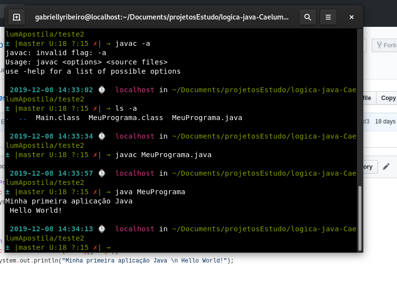

# estudos-logica-de-programacao
##Exercícios de lógica de programação em Js, Java, e alguns algorítimos em Portugol

Listas de exercícios em Java da Fatec, exercícios em Javascript feitos conforme o cursos da Alura/Caelum, e apostila Caelum. 
Além de exercícios feitos em sala de aula no bootcamp

